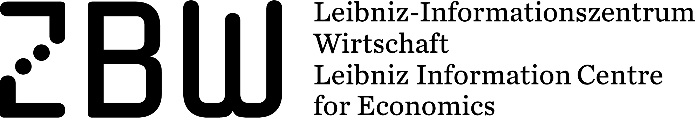

# Linked Open Citation Database

## About

LOC-DB is a distributed maintainable database for storage extrapolation of citation metadata.

This page will contain all information necessary to set up a local LOC-DB node, including the [back-end](https://github.com/locdb/loc-db) and the [front-end](https://github.com/locdb/locdb-frend).
Note that both components do not have to be installed on the same machine.
The back-end will hold the data-base and provide a REST interface.
The front-end provides a GUI for the extrapolation of citations.

Check the LOC-DB [blog](https://locdb.bib.uni-mannheim.de/blog/en/) for more information about the associated project.

## Back-end setup

1. Install [MongoDB](https://www.mongodb.com/).

2. `git clone https://github.com/locdb/loc-db`

3. `cd loc-db && npm install`

4. `swagger project start`

## Front-end setup

1. `git clone https://github.com/locdb/locdb-frend`

2. `cd locdb-friend && npm install`

3. Edit `src/app/locdb.service.ts`, such that `private locdbUrl` points to the back-end.

3. `ng serve`

## Project partners

## Funded by

Deutsche Forschungsgemeinschaft (DFG)

